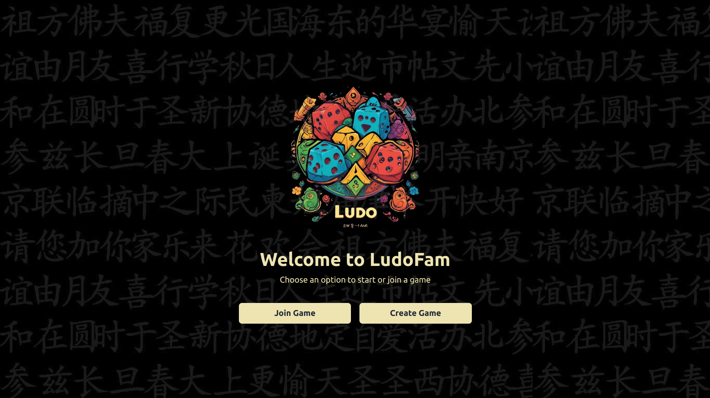

# **Ludo Multiplayer Game**

A real-time multiplayer Ludo game where players can join, play, and roll dice using WebSocket for seamless interaction. The game supports up to 4 players and offers an intuitive user interface built with modern frontend technologies.

<p align="center">
  
  
</p>

## **Table of Contents**
- [Features](#features)
- [Technologies Used](#technologies-used)
- [Installation](#installation)
- [Usage](#usage)
- [Gameplay](#gameplay)
- [Development Workflow](#development-workflow)
- [Configuration](#configuration)
- [Contributing](#contributing)
- [License](#license)

---

## **Features**
- Real-time multiplayer gameplay with WebSocket communication.
- Waiting lobby for players to join via game code.
- Game starts when 4 players have joined.
- Visual Ludo board displayed in the frontend.
- Dice rolling functionality with controlled server-side validation.
- Popup notifications for game events like game won, turn skip, etc.
- Turn management with player skipping logic based on the number of players.

## **Technologies Used**
### **Frontend:**
- **React.js**: For building the interactive UI.
- **WebSocket**: For real-time communication between players and the server.
- **Tailwind CSS**: For responsive, utility-first styling.
- **Recoil.js**: For state management across the application.

### **Backend:**
- **Node.js**: Server-side logic and WebSocket handling.
- **WebSocket**: Server-side management of player actions.
- **Express.js**: For routing and handling HTTP requests if needed.

### **Deployment:**
- **AWS**: Backend and Frontend deployed with WebSocket support (`ws` protocol), using Nginx.

---

## **Installation**

### **Prerequisites**
- **Node.js** and **npm** installed.
- A modern browser to run the frontend.
- Internet connection to support real-time play.

### **Backend Installation**
1. Clone the repository:
    ```bash
    git clone https://github.com/NIXBLACK11/Ludo.git
    cd Ludo/server
    ```
2. Install dependencies:
    ```bash
    npm install
    ```
3. Start the backend server:
    ```bash
    npm start
    ```

### **Frontend Installation**
1. Clone the frontend repository:
    ```bash
    git clone https://github.com/NIXBLACK11/Ludo.git
    cd Ludo/client
    ```
2. Install frontend dependencies:
    ```bash
    npm install
    ```
3. Start the frontend development server:
    ```bash
    npm start
    ```

---

## **Usage**

1. Open the game in the browser.
2. Enter a game code or create a new game.
3. Wait for other players to join.
4. Once four players have joined, the game will automatically start.
5. Take turns rolling the dice and moving your pieces across the Ludo board.

---

## **Gameplay**
- Each player takes turns rolling the dice by clicking on it.
- Dice roll values are validated and sent from the server to prevent cheating.
- The game includes turn-skipping logic based on player count.
- Popups notify players of important events (like who won the game).

---

## **Development Workflow**

### **WebSocket Communication**
- The game waits for `start_game` WebSocket messages from the backend before starting.
- Players interact with the server through WebSocket for actions like rolling dice, moving pieces, etc.

### **UI Management**
- The frontend UI, built with React and Tailwind CSS, renders the Ludo board and game status dynamically.
- State management is handled by Recoil for real-time updates on player actions.

---

## **Configuration**

### **Environment Variables**
You can configure the backend with the following environment variables:

```bash
PORT=5000 # Port for the backend server
```

For the frontend, ensure WebSocket URLs are correctly set based on your deployment.

```bash
REACT_APP_WS_URL=ws://your-backend-url
```

---

## **Contributing**
Contributions are welcome! To contribute:
1. Fork the project.
2. Create your feature branch:
    ```bash
    git checkout -b feature/awesome-feature
    ```
3. Commit your changes:
    ```bash
    git commit -m 'Add some awesome feature'
    ```
4. Push to the branch:
    ```bash
    git push origin feature/awesome-feature
    ```
5. Open a pull request.

---

## **License**
This project is licensed under the MIT License. See the [LICENSE](./LICENSE) file for more details.

---
